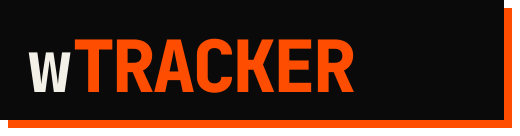
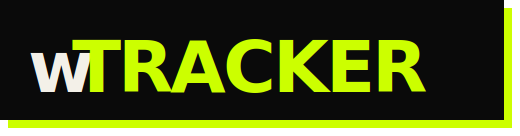
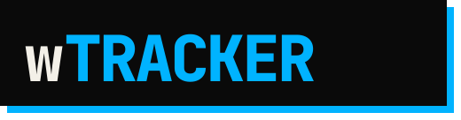
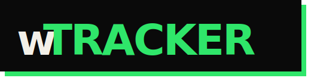

<div align="center">



### **lift heavy. track honestly. pay nothing.**

<br>


</div>

<br>

> We were tired of opening "free" lift trackers and hitting a paywall before we could log our second exercise. **$80 for a lifetime license. $10/month subscriptions. Features locked behind "Pro."** For a spreadsheet with a timer. So we built wTracker. It does more. It costs nothing. We're keeping it that way.

<br>

---

## `THE APP`

A brutalist-styled strength tracker with a hand-rolled drag-to-reorder system, composite strength score, per-lift charts, and the most aggressive customization layer we could pack into 12 screens. Four tabs:

<table>
<tr>
<td width="25%" align="center" valign="top">
<h3><code>HUB</code></h3>
<sub><b>Muscle profile radar</b><br>Composite strength rank<br>Recent PRs w/ 1RM<br>Per-group detail charts</sub>
</td>
<td width="25%" align="center" valign="top">
<h3><code>PLANS</code></h3>
<sub><b>Reorderable templates</b><br>PPL · U/L · FB · BRO · CUSTOM<br>Per-template set overrides<br>Drag-sort filter bar</sub>
</td>
<td width="25%" align="center" valign="top">
<h3><code>PROG</code></h3>
<sub><b>Per-exercise history</b><br>4W · 12W · 26W · 52W scales<br>Max-weight tracking<br>Ranked by group</sub>
</td>
<td width="25%" align="center" valign="top">
<h3><code>LOG</code></h3>
<sub><b>Quick-log or create-plan</b><br>Active session w/ rest timer<br>Mid-session template save<br>Edit as you go</sub>
</td>
</tr>
</table>

<br>

---

## `UNIQUE CUSTOMIZABILITY`

Most trackers give you a color picker and call it customization. wTracker lets you bend the whole layout to your training. The wordmark itself repaints with your accent:

<div align="center">
  
  
  
  
  
</div>

### Accents

Pick one. The entire app — radar fills, PR halos, drag-ghost shadows, button chrome — recolors instantly. Light and dark modes both adapt.

<div align="center">


</div>

### Muscle Profile — bidirectional order sync

12 muscle groups available. Toggle any on or off. Drag to reorder. **The order you set in the tweaks panel is the order of the radar axes, the order of the pills on the hub, and the order of the detail pages — all three update together.**

```
CHEST · BACK · SHLDR · ARMS · LEGS · CORE
NECK  · CALVES · GLUTES · F.ARM · TRAPS · ABS
```

### Templates

- **Reorder template cards** by drag
- **Drag-sort filter pills** (`ALL / PPL / U/L / FB / BRO / CUSTOM`)
- **Per-template overrides** — change set counts or exercise order without touching the source template
- **Promote a session to a template** after finishing, inline

### Everything else

| Setting         | Options                                     |
|-----------------|---------------------------------------------|
| **Unit**        | `LBS` · `KG` — converts all weights live    |
| **Theme**       | `LIGHT` · `DARK`                            |
| **Radar style** | `GRADIENT` · `FLAT`                         |
| **Density**     | `COMPACT` · `ROOMY` — changes row heights   |
| **Default rest**| `0 – 600` seconds                           |
| **Favorites**   | Star exercises to float them in the picker  |
| **Exercise order** | Per-group, persisted                     |
| **Tab order**   | Reorder the bottom nav itself               |

<br>

---

## `DRAG TO REORDER, EVERYWHERE`

Long-press anything that looks like a list. The reorder animation is hand-rolled — not `ReorderableListView` — and consistent across the whole app:

- **Ghost overlay** that tilts as it lifts off the page
- **Ink drop-shadow** + **accent halo** that grow on pickup and settle on drop
- **Neighbors slide** via `AnimatedPositioned` — no snap, no flicker
- **200ms drop-settle tween** when you release that cross-fades the ghost back into its new slot
- **Locked cells** (e.g. the `ALL` pill on the hub) refuse to become drop targets

Same system on: template cards, template filter bar, exercise cards, muscle-profile pills, tracked-group grid, exercise-picker filters.

<br>

---

## `FEATURES`

<table>
<tr>
<td width="50%" valign="top">

### Per-Exercise Weight Tracking
Log weight × reps for **any exercise independently**. Bench, squat, deadlift, OHP — each charted separately with full history.

### Rep-PR 1RM Estimates
Hit a rep PR? The app shows your estimated one-rep max using Epley's formula (`w × (1 + reps/30)`) right next to the logged weight.

### Composite Strength Score
A single number computed from your tracked lifts, normalized across groups, with a rank band:

`BEGINNER → NOVICE → INTERMEDIATE → ADVANCED → ELITE`

</td>
<td width="50%" valign="top">

### Muscle Profile Radar
Weekly volume per group rendered as a radar chart. Tap any axis for the detail view with 4W / 12W / 26W / 52W scales, **y-axis labels, quartile x-axis ticks, and ranked stats**.

### Quick Log & Create Plan
Two logging modes in one sheet. Spin up a quick ad-hoc session or build a multi-week plan. Switch mid-flow without losing state. Defaults to `QUICK LOG`.

### Zero Account
No email. No cloud. No analytics. No sync server. Everything lives on your device as a single JSON file.

</td>
</tr>
</table>

<br>

---

## `HOW IT WORKS`

### Stack

- **Flutter** (SDK `^3.11.4`) — one codebase, iOS + Android + web
- **JetBrainsMono** via `google_fonts` for the monospace brutalist type
- **flutter_svg** for inline wordmark re-theming (the `#0a0a0a` ink and `#F3F0E8` paper inside the SVG are string-replaced with the live palette at render time)
- **path_provider** for local JSON persistence — the entire app state fits in one file

### Architecture

```
lib/
├── main.dart              ← root app shell + tab switching + overlay style
├── theme.dart             ← BrutalPalette + the 5 accents + mono() helper
├── data.dart              ← canonical muscle groups + stock templates
├── models.dart            ← Template / Exercise / SessionRecord / PrRow
├── state.dart             ← Tweaks (settings) + Prefs (cross-screen), ChangeNotifiers
├── storage.dart           ← JSON read/write via path_provider
├── history.dart           ← session records + PR + group-stat derivation
├── screens/
│   ├── dashboard.dart     ← hub: radar + recent PRs + detail charts
│   ├── templates.dart     ← plans: filter bar + reorderable cards
│   ├── progression.dart   ← prog: per-lift charts + group filter
│   ├── log_sheet.dart     ← modal: quick-log + create-plan
│   ├── active_workout.dart← in-session with rest timer
│   ├── exercise_picker.dart
│   └── tweaks_panel.dart  ← the settings panel
└── widgets/
    ├── drag_list.dart     ← vertical reorder engine
    ├── group_grid.dart    ← horizontal reorder engine
    ├── muscle_radar.dart  ← custom radar painter
    └── primitives.dart    ← AppHeaderBar, IconSquare, DashedLine, Segmented, …
```

### State model

Two top-level `ChangeNotifier`s thread through the tree:

| Notifier | Owns |
|---|---|
| **`Tweaks`** | theme, accent, unit, radar style, density, default rest, tracked groups, group order |
| **`Prefs`** | template order, template overrides, exercise favorites, per-group exercise order, tab order, filter order |

Both persist their entire state as JSON after any mutation. No debounce — writes are cheap because the payload is tiny (~kilobytes).

### Drag pipeline

Each draggable cell:
1. **Captures** a ghost snapshot at pointer-down via `ImmediateMultiDragGestureRecognizer`
2. **Renders** the ghost in the root `Overlay` with tilt + accent drop-shadow
3. **Animates** sibling cells via `AnimatedPositioned` inside a `Stack` with `ValueKey('pos-$item')` identity so Flutter tweens positions instead of rebuilding
4. **Runs a 200ms drop-settle tween** on release that decays the ghost's shadow + tilt as it snaps into the target slot

The pattern lives in three places — vertical (`drag_list.dart`), horizontal grid (`group_grid.dart`), and bespoke horizontal filter bars (`templates.dart::_FilterBarDraggable`, `dashboard.dart::_PageBarDraggable`, `exercise_picker.dart::_TabBarDraggable`) — each with the same visual language.

<br>

---

## `GET STARTED`

```bash
git clone https://github.com/Peter-Zhao-751/wtracker
cd wtracker
flutter pub get
flutter run
```

Or grab a build from the **Releases** page. APK for Android, IPA for iOS.

### Builds

```bash
flutter build apk --release          # Android APK
flutter build ipa --release          # iOS (macOS only)
flutter build web --release          # Static web bundle
```

<br>

---

<div align="center">

## `PRICING`

### ~~`$79.99`~~ → **`$0.00`**

No trial. No freemium. No "unlock with a review." Just the app.

</div>

<br>

---

## `CONTRIBUTING`

Found a bug? Want a feature? Open an issue or send a PR.

This was built in two hours by two people who were annoyed. With a little help it can be something genuinely great — and still free.

<br>

---

<div align="center">

<sub>made with frustration and Flutter · MIT licensed · no paywalls were harmed in the making of this app</sub>

</div>
